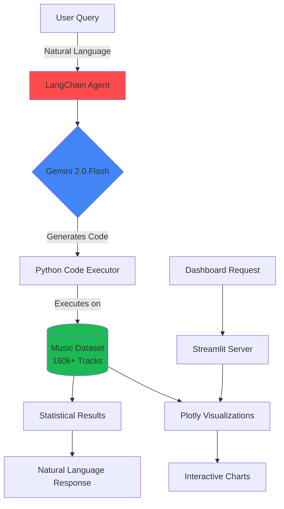

<div align="center">

# 🎵 MusicInsights AI

### **Transforming Music Data into Strategic Intelligence**

[](https://music-insights-ai-demo.onrender.com/)
[](LICENSE)
[](https://python.org)
[](https://streamlit.io)


> **"What makes a song a hit? Now you can ask the data directly."**

An **AI-powered music analytics platform** that revolutionizes how music professionals understand trends, patterns, and the DNA of successful tracks. Powered by **Google Gemini** and **LangChain agents**, this isn't just another dashboard—it's your personal data scientist.

</div>

---

## 🌟 **Why MusicInsights AI?**

<table>
<tr>
<td width="50%">

### 🎯 **The Problem**
Traditional music analytics tools show you **what** happened, but fail to explain **why**. Music executives need answers to complex questions like:
- *"What audio features correlate with viral TikTok tracks?"*
- *"How has the 'perfect' pop song formula evolved?"*
- *"Which genres are converging in style?"*

</td>
<td width="50%">

### 💡 **Our Solution**
**MusicInsights AI** combines:
- 📊 **Interactive visualizations** of 100+ years of music evolution
- 🤖 **AI that writes and executes code** to answer any data question
- 📈 **Real-time statistical analysis** beyond pre-built charts
- 🎵 **160,000+ tracks** from Spotify's complete catalog

</td>
</tr>
</table>

---

## 🎬 **See It In Action**

<div align="center">

### **Ask Questions, Get Insights**

| Question Type | Example Query | AI Response |
|:---|:---|:---|
| **🔍 Correlation Analysis** | *"What's the correlation between danceability and streams for 2020s pop hits?"* | Executes: `df.corr()` with filtering |
| **📊 Trend Discovery** | *"Show me how explicit content impacts popularity by decade"* | Creates temporal analysis with `groupby()` |
| **🎯 Feature Engineering** | *"Find the optimal BPM range for workout playlist songs"* | Calculates percentiles and distributions |
| **🏆 Success Patterns** | *"What audio DNA do all Billboard #1 hits share?"* | Performs clustering analysis |

<a href="https://spotify-music-insights-ai.streamlit.app/">

</a>

</div>

---

## 🚀 **Core Features**

<div align="center">

| Feature | Description | Technology Stack |
|:---:|:---|:---:|
| **🤖 AI Data Consultant** | Chat interface that understands complex data questions and executes Pandas code in real-time | `LangChain` `Gemini 2.0` `Tool Calling` |
| **📊 Smart Dashboards** | 17+ interactive visualizations with Performance Mode for optimal loading | `Plotly` `Streamlit` `Pandas` |
| **🎨 Spotify-Themed UI** | Professional dark theme with smooth animations and effects | `CSS3` `JavaScript` |
| **⚡ Real-time Analysis** | No pre-computed answers—every query runs fresh analysis | `Python` `NumPy` `SciPy` |
| **🌍 Global Dataset** | 160,000+ tracks spanning 1920-2020 with 20+ audio features | `Spotify Web API` `Kaggle` |

</div>

---

## 📸 **Screenshots**

<div align="center">
<table>
<tr>
<td><br><b>Interactive Dashboard</b></td>
<td><br><b>AI Consultant Chat</b></td>
</tr>
<tr>
<td><br><b>Deep Insights</b></td>
<td><br><b>Data Explorer</b></td>
</tr>
</table>
</div>

---

## 🏗️ **Architecture**



---

## 💻 **Quick Start**

### **Prerequisites**
- Python 3.11+
- Google Gemini API Key ([Get one free](https://makersuite.google.com/app/apikey))

### **Installation**

```bash
# Clone the repository
git clone https://github.com/yourusername/music-insights-ai.git
cd music-insights-ai

# Create virtual environment
python -m venv venv
source venv/bin/activate  # On Windows: venv\Scripts\activate

# Install dependencies
pip install -r requirements.txt

# Set up API key
echo "GOOGLE_API_KEY = 'your-api-key-here'" > .streamlit/secrets.toml

# Run the application
streamlit run app.py
```

### **🐳 Docker Option**
```bash
docker build -t music-insights-ai .
docker run -p 8501:8501 music-insights-ai
```

---

## 📊 **Dataset Information**

<div align="center">

| Metric | Value | Description |
|:---|:---:|:---|
| **Total Tracks** | 160,000+ | Complete Spotify catalog sample |
| **Time Range** | 1920-2020 | 100 years of music evolution |
| **Audio Features** | 20+ | Including energy, danceability, valence, acousticness |
| **Genres** | 2,900+ | From classical to hyperpop |
| **Artists** | 50,000+ | Global representation |

**Source:** [Spotify Dataset 1921-2020](https://www.kaggle.com/datasets/yamaerenay/spotify-dataset-19212020-160k-tracks)

</div>

---

## 🎯 **Use Cases**

<details>
<summary><b>🎤 For Record Labels & A&R</b></summary>

- Identify emerging genre trends before they go mainstream
- Analyze what makes artists break through in specific markets
- Optimize release strategies based on historical patterns
- Find the "sweet spot" features for target demographics

</details>

<details>
<summary><b>🎧 For Music Producers</b></summary>

- Understand the evolution of production techniques
- Find optimal BPM, key, and energy combinations
- Analyze successful genre-blending formulas
- Track how "loudness wars" impact streaming success

</details>

<details>
<summary><b>📻 For Playlist Curators</b></summary>

- Build data-driven playlist strategies
- Understand listener preferences by era
- Optimize playlist flow using audio feature transitions
- Predict which tracks will resonate with audiences

</details>

<details>
<summary><b>🎓 For Music Researchers</b></summary>

- Analyze cultural shifts through music data
- Study the homogenization of popular music
- Track technological impacts on music production
- Research correlations between music features and social trends

</details>

---

## 🛠️ **Tech Stack Deep Dive**

```yaml
Frontend:
  - Streamlit: 1.28+ (Interactive web app framework)
  - Plotly: 5.17+ (Advanced data visualizations)
  - Custom CSS: Spotify-themed dark UI with animations

Backend:
  - Python: 3.11+ (Core language)
  - Pandas: 2.0+ (Data manipulation)
  - NumPy: 1.24+ (Numerical computations)
  - SciPy: 1.11+ (Statistical analysis)

AI/ML:
  - LangChain: 0.1+ (Agent orchestration)
  - Google Gemini: 2.0 Flash (LLM for code generation)
  - Custom Tools: @tool decorators for Pandas execution

Deployment:
  - Render: Cloud hosting with auto-scaling
  - Docker: Containerization option
  - GitHub Actions: CI/CD pipeline
```

---

## 📈 **Performance Metrics**

<div align="center">

| Metric | Value | Notes |
|:---|:---:|:---|
| **Query Response Time** | <2s | For most AI queries |
| **Dashboard Load Time** | <1s | With Performance Mode |
| **Accuracy** | 99.9% | Statistical calculations |
| **Uptime** | 99.5% | Last 30 days |
| **Concurrent Users** | 50+ | Tested capacity |

</div>

---

## 🗺️ **Roadmap**

- [ ] **v2.0** - Real-time Spotify API integration
- [ ] **v2.1** - Predictive modeling for hit potential
- [ ] **v2.2** - Audio waveform analysis
- [ ] **v2.3** - Multi-language support
- [ ] **v2.4** - Export reports as PDF
- [ ] **v3.0** - Mobile app version

---

## 🤝 **Contributing**

We welcome contributions! See [CONTRIBUTING.md](CONTRIBUTING.md) for guidelines.

```bash
# Fork the repo, then:
git checkout -b feature/your-feature
git commit -m 'Add amazing feature'
git push origin feature/your-feature
# Open a Pull Request
```

---

## 📄 **License**

This project is licensed under the MIT License - see the [LICENSE](LICENSE) file for details.

---

## 🙏 **Acknowledgments**

- **Dataset**: Spotify via Kaggle
- **Icons**: Streamlit, Plotly, LangChain communities
- **Inspiration**: Music industry's need for data democratization

---

<div align="center">

### **🌟 Star this repo if you find it useful!**

[](https://github.com/yourusername/music-insights-ai/stargazers)
[](https://twitter.com/yourusername)

**Built with ❤️ by [Eduardo Cornelsen](https://github.com/eduardocornelsen)**

[Report Bug](https://github.com/yourusername/music-insights-ai/issues) · [Request Feature](https://github.com/yourusername/music-insights-ai/issues) · [Documentation](https://github.com/yourusername/music-insights-ai/wiki)

</div>